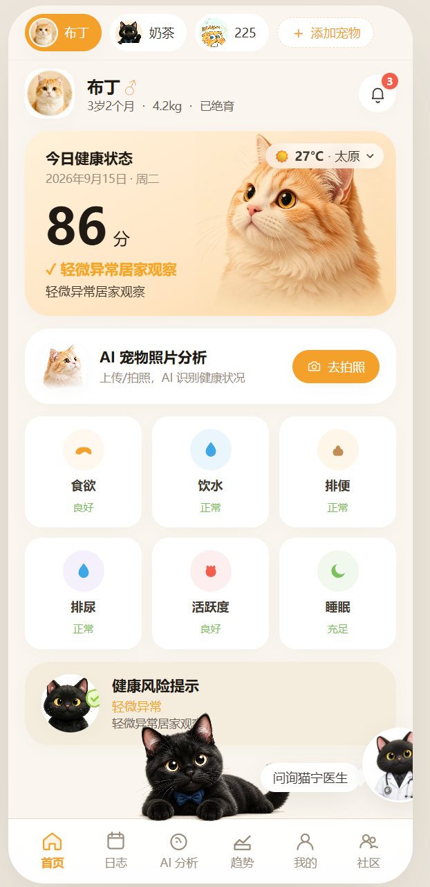
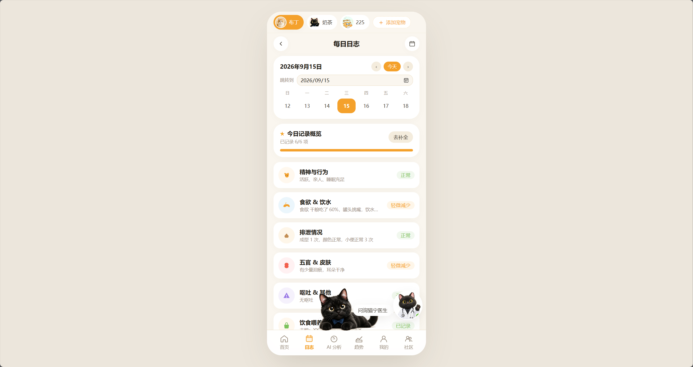
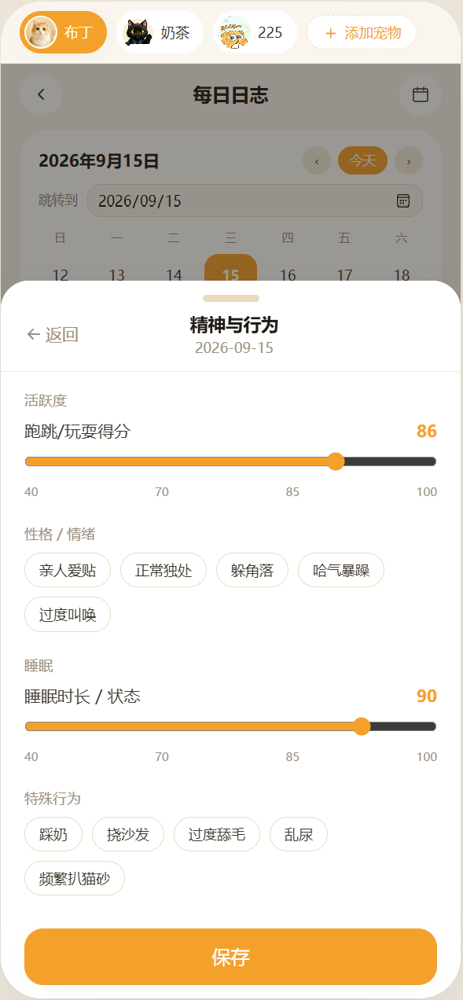
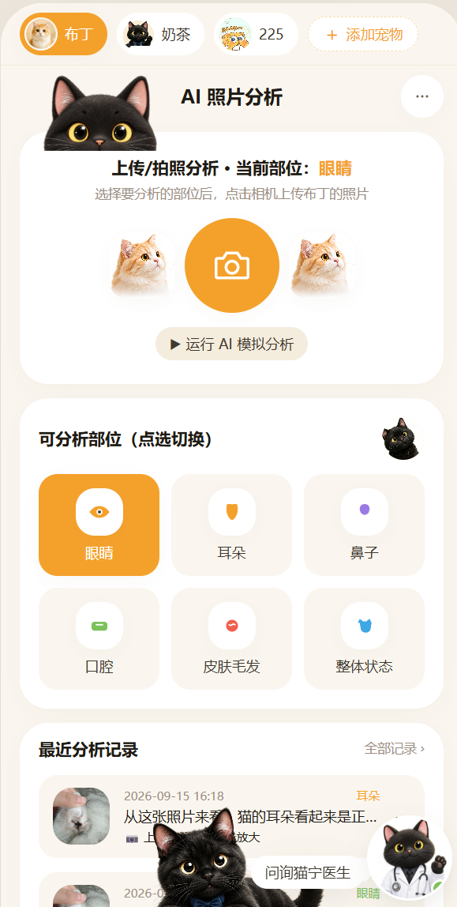
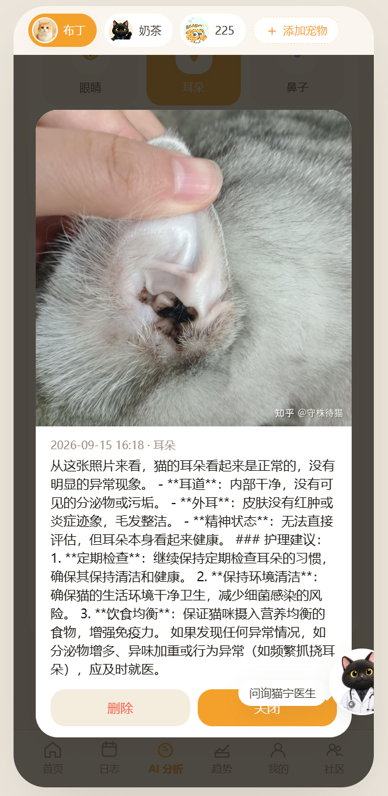
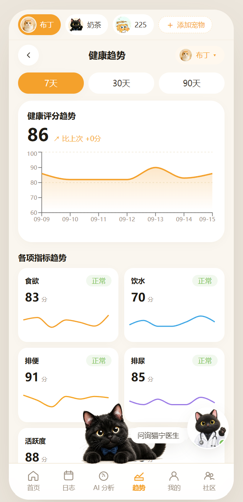
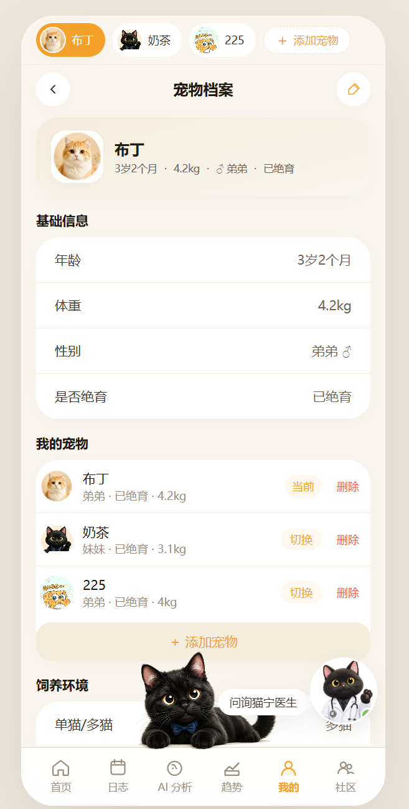
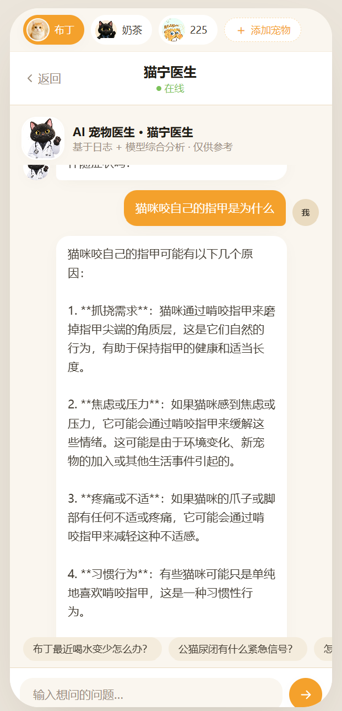
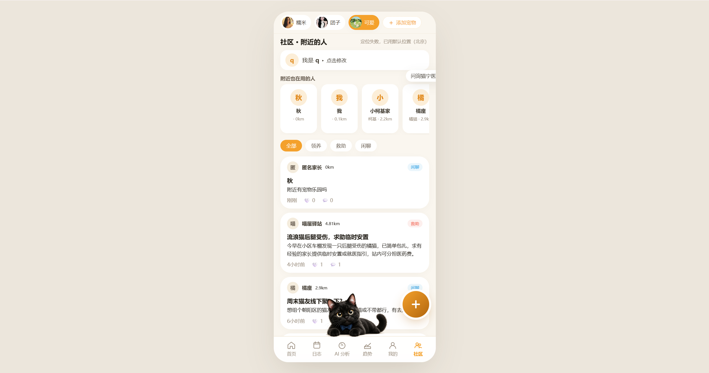
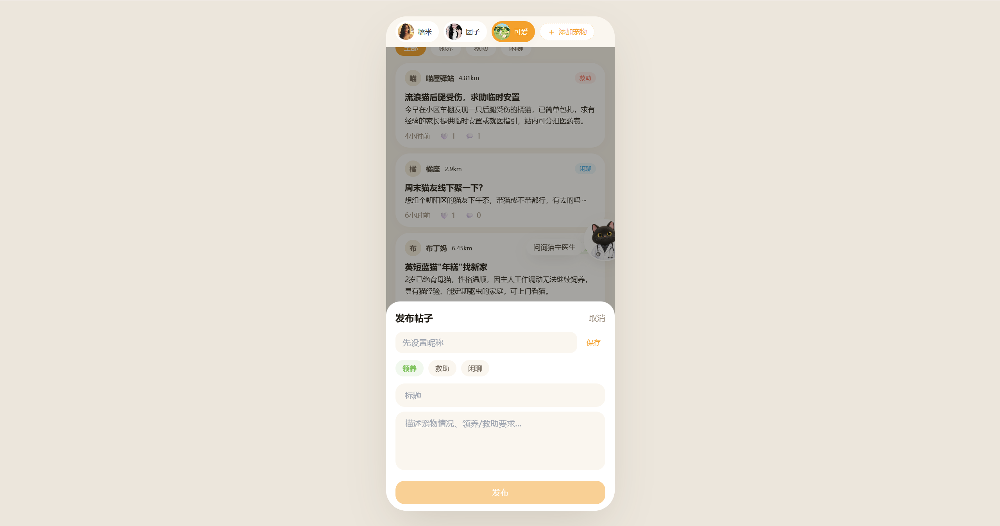

# PetCare Companion · 宠物健康 AI 助手

一款面向养猫、养狗家庭的移动端 H5 应用，围绕「日常记录 → AI 分析 → 健康趋势 → 在线问诊 → 附近互助」这条主线设计。项目包含完整的前端界面、本地可运行的社区后端，以及可接入真实大模型的对话与视觉分析能力。

    

---

## 目录

- [功能概览](#功能概览)
- [页面截图与说明](#页面截图与说明)
- [实际功能用途与影响](#实际功能用途与影响)
- [项目优势](#项目优势)
- [未来发展方向](#未来发展方向)
- [技术栈](#技术栈)
- [环境要求](#环境要求)
- [快速开始](#快速开始)
- [配置说明](#配置说明)
- [目录结构](#目录结构)
- [复现说明](#复现说明)
- [License](#license)

---

## 功能概览

| 模块 | 说明 |
|------|------|
| **首页** | 宠物卡片、今日健康评分、实时天气、健康指标速览、AI 照片分析入口、底部黑猫互动 |
| **每日日志** | 8 大维度（精神与行为、食欲饮水、排泄、五官皮肤、呕吐其他、体温、饮食喂养、总结）滑动评分 + 标签录入 |
| **AI 照片分析** | 选择眼睛 / 耳朵 / 鼻子 / 口腔 / 皮肤毛发 / 整体，上传照片后由模型生成健康观察与护理建议 |
| **健康趋势** | 7 / 30 / 90 天综合评分曲线 + 6 项指标迷你折线图 |
| **宠物档案** | 多宠物切换、年龄体重绝育信息、饲养环境、免疫驱虫时间轴 |
| **猫宁医生** | 可拖动的悬浮 AI 医生，支持自然语言问诊；未配置模型时自动回落规则兜底 |
| **社区** | 基于定位的「附近的人」、领养 / 救助 / 闲聊帖子流、发帖、点赞、评论 |
| **底部黑猫** | 点击随机触发伸懒腰 / 吃饭 / 跑动 / 爱心动画，长按变睡觉球 |

---

## 页面截图与说明

### 1. 首页

顶部可切换多只宠物，显示今日健康评分、实时天气、6 项健康指标。天气点击后可以选择城市，数据来自 Open-Meteo 真实接口。底部「猫宁医生」悬浮入口和躺姿黑猫常驻。

<div align="center"></div>

### 2. 每日日志

按天记录宠物状态，支持日期切换。卡片展示当天各维度录入情况，点击进入对应录入面板。

<div align="center"></div>

### 3. 日志录入

以「精神与行为」为例，使用滑块评分和标签多选，覆盖活跃度、性格情绪、睡眠、异常行为等。保存后自动影响当日健康评分。

<div align="center"></div>

### 4. AI 照片分析

选择要分析的部位后上传或拍照。分析结果会按部位生成观察结论和护理建议，并保留历史记录。

<div align="center"></div>

### 5. AI 分析结果

以耳朵分析结果为例，模型会给出耳道、外耳、精神状态等维度的观察，并列出护理建议。图片分析依赖所配置的大模型视觉能力，未配置 key 时会有明确提示。

<div align="center"></div>

### 6. 健康趋势

支持 7 / 30 / 90 天维度切换，顶部为综合评分曲线，下方为食欲、饮水、排便、排尿、活跃度等指标的趋势小图。

<div align="center"></div>

### 7. 宠物档案

展示当前选中宠物的基础信息，支持多宠物切换、添加 / 删除宠物、编辑饲养环境等。

<div align="center"></div>

### 8. 猫宁医生

全屏对话界面。支持文字提问，模型会结合宠物档案与日志上下文给出建议。问诊结果仅供参考，不能替代线下兽医诊断。

<div align="center"></div>

### 9. 社区页

授权定位后展示附近的其他用户与帖子流。帖子按领养、救助、闲聊分类筛选，按发布时间倒序排列，显示距离。

<div align="center"></div>

### 10. 发布帖子

点击右下角「+」按钮弹出发布面板，先设置昵称（首次），再选择帖子类型、填写标题和正文即可发布。发布后帖子会立即出现在列表中。

<div align="center"></div>

### 11. 底部黑猫互动

黑猫默认趴卧，点击会随机播放一段动画，例如吃饭、头顶冒爱心、伸懒腰、跑动，增加页面趣味性。

| 吃饭 | 爱心 | 伸懒腰 | 跑动 | 睡觉 |
|------|------|--------|------|------|
|  |  |  |  |  |

---

## 实际功能用途与影响

1. **降低日常记录门槛**
   把零散的饮食、排便、精神状态等记录结构化，滑动评分和标签比纯文字更高效，便于长期追踪。

2. **让异常更容易被发现**
   综合评分和趋势曲线可以把「今天食欲一般」这种模糊感受量化为可对比的数据，帮助主人更早注意到变化。

3. **提供初步健康参考**
   AI 照片分析和猫宁医生能在不方便立即就医时给出方向性建议，但结果明确标注为参考，紧急情况会提示尽快就医。

4. **连接附近宠主**
   社区功能让领养、救助、线下聚会等信息在同城范围内流通，增加了实际互助的可能性。

---

## 项目优势

- **完整移动端 H5 体验**：页面按手机壳尺寸设计，桌面端居中显示，手机端自动全屏。
- **真实 AI 可接入**：对话和图片分析都已预留 OpenAI 兼容接口，配置 key 即可使用真实大模型；未配置时也有规则兜底，不直接报错。
- **本地即可跑通社区**：自带 Node 零依赖社区后端，同一局域网内多台设备访问同一后端即可真实互通。
- **天气免 key**：Open-Meteo 接口无需申请密钥，城市选择 + 实时温度开箱即用。
- **状态持久化**：宠物档案、日志、天气城市、医生位置、LLM 配置等通过 localStorage 保存。
- **交互细节**：底部黑猫动画、猫宁医生可拖动、FAB 发布按钮等，提升产品感。

---

## 未来发展方向

1. **后端上云**：把当前本地 JSON 存储的社区后端迁移到数据库 + 鉴权体系，实现真正的公网多用户社区。
2. **接入兽医预约**：在发现异常或紧急提示时，提供附近医院 / 在线问诊预约入口。
3. **多模态模型增强**：当视觉模型能力更强时，可进一步支持皮肤病变、耳道分泌物等更细粒度的识别。
4. **用药与驱虫提醒**：在宠物档案基础上增加日程提醒，如疫苗、驱虫、体检。
5. **数据导出**：支持把日志和趋势导出为 PDF 健康报告，方便就医时带给兽医。
6. **多端同步**：当前数据存在浏览器本地，后续可通过账号体系实现跨设备同步。

---

## 技术栈

| 类别 | 技术 |
|------|------|
| 框架 | React 18 + TypeScript 5 |
| 构建 | Vite 5 |
| 样式 | TailwindCSS 3（移动端 H5 自适应） |
| 路由 | React Router 6（BrowserRouter） |
| 状态管理 | Zustand 4（持久化到 localStorage） |
| 图表 | Recharts 2 |
| 动效 | Framer Motion 11 |
| 图标 | lucide-react + 自绘 SVG |
| 日期 | dayjs |
| 社区后端 | Node.js 内置 http + fs（零依赖） |
| 天气 | Open-Meteo API（免 key） |
| 大模型代理 | Vite 开发服务器中间件 `/api/llm` |

---

## 环境要求

- Node.js ≥ 18
- npm 或 pnpm
- 一个 OpenAI 兼容的大模型 API Key（可选，用于 AI 问诊和图片分析；未配置时自动使用规则兜底）

推荐免费/低成本模型：

| 服务商 | 模型 | 特点 |
|--------|------|------|
| 智谱 AI | `glm-4v-flash` | 免费、支持视觉、国内访问稳定 |
| DeepSeek | `deepseek-chat` | 价格低、中文效果好 |
| OpenRouter | `google/gemini-flash-1.5` | 聚合多厂商、有免费额度 |

---

## 快速开始

```bash
# 1. 克隆仓库
git clone https://github.com/kll237/Pet-Doctor.git
cd Pet-Doctor

# 2. 安装依赖
npm install

# 3. 启动前端开发服务器
npm run dev
# 打开 http://localhost:5173
```

桌面浏览器会显示为手机壳样式；用手机浏览器或 DevTools 移动模拟器打开则会自动全屏。

### 启动社区后端（可选）

社区功能依赖本地后端，默认端口 `8787`：

```bash
node server/index.js
```

启动后会自动在 `server/data.json` 生成种子数据。同一局域网内多设备访问同一个后端地址即可互通点赞、评论、发帖。

### 构建生产版本

```bash
npm run build      # 输出到 dist/
npm run preview    # 本地预览生产版本
```

`dist/` 为纯静态产物，可部署到 Vercel、Netlify、GitHub Pages、CloudStudio 或任意 CDN。

---

## 配置说明

### 大模型 Key 配置

项目支持两种方式配置 LLM：

**方式一：开发环境文件（推荐开发者本地使用）**

在项目根目录创建 `.env.local`：

```bash
VITE_LLM_API_KEY=your_api_key_here
VITE_LLM_BASE_URL=https://open.bigmodel.cn/api/paas/v4
VITE_LLM_MODEL=glm-4v-flash
VITE_LLM_PROVIDER=zhipu
```

`.env.local` 已被 `.gitignore` 排除，不会进入仓库。

**方式二：设置页配置（普通用户使用）**

运行应用后，进入「设置 → AI 模型设置」，选择服务商并填入 key，配置会写入浏览器 localStorage。

### 天气

天气使用 Open-Meteo 免费接口，无需配置 key。城市列表内置中国主要城市，也支持搜索全球城市。

### 社区后端地址

默认指向 `http://localhost:8787`，定义在 `src/lib/community.ts`。如果部署到公网，请把 `BASE` 改为对应后端地址。

---

## 目录结构

```
.
├── index.html                 # HTML 入口
├── package.json
├── vite.config.ts             # Vite 配置 + /api/llm 代理
├── postcss.config.js
├── tailwind.config.js
├── tsconfig*.json
├── server/
│   └── index.js               # 社区后端（附近的人 + 帖子 + 点赞评论）
├── public/
│   ├── favicon.svg
│   └── cats/                  # 猫咪图片、动画资源
├── src/
│   ├── App.tsx                # 路由入口
│   ├── main.tsx               # 渲染入口
│   ├── components/            # 公共组件
│   │   ├── Layout.tsx         # 手机壳 + 安全区
│   │   ├── BottomNav.tsx      # 底部 6 项 Tab
│   │   ├── BottomCat.tsx      # 底部黑猫动画
│   │   ├── BlackCatDoctor.tsx # 悬浮 AI 医生
│   │   ├── RecordSheet.tsx    # 日志录入面板
│   │   └── ...
│   ├── pages/                 # 页面
│   │   ├── Home.tsx           # 首页
│   │   ├── Log.tsx            # 每日日志
│   │   ├── AIAnalysis.tsx     # AI 照片分析
│   │   ├── Trend.tsx          # 健康趋势
│   │   ├── Profile.tsx        # 宠物档案
│   │   ├── Community.tsx      # 社区
│   │   ├── Settings.tsx       # AI 设置
│   │   └── ...
│   ├── store/                 # Zustand store
│   │   ├── petStore.ts
│   │   ├── logStore.ts
│   │   ├── analysisStore.ts
│   │   ├── chatStore.ts
│   │   ├── weatherStore.ts
│   │   └── ...
│   ├── lib/                   # 工具与 API 层
│   │   ├── llm.ts             # 大模型对话与视觉分析封装
│   │   ├── aiDoctor.ts        # 规则兜底医生逻辑
│   │   ├── community.ts       # 社区前端 API
│   │   └── utils.ts
│   ├── data/seed.ts           # 默认宠物与算法数据
│   ├── types/index.ts         # TypeScript 类型
│   └── styles/index.css       # TailwindCSS 入口
└── docs/screenshots/          # 项目截图
```

---

## 复现说明

如果你想在自己的机器上完整复现这个项目：

1. 确保已安装 Node.js ≥ 18。
2. 克隆仓库后执行 `npm install` 安装依赖。
3. 直接 `npm run dev` 即可看到前端全部功能（日志、趋势、档案、黑猫互动、天气等）。
4. 如需体验 AI 问诊和图片分析，按「配置说明」填入大模型 key；不填也不会报错，会自动使用规则回复。
5. 如需体验社区的发帖、点赞、附近的人，需要额外启动 `node server/index.js`。
6. 所有持久化数据均保存在浏览器 localStorage，清除浏览器存储即可恢复初始演示数据。

---

## License

MIT
